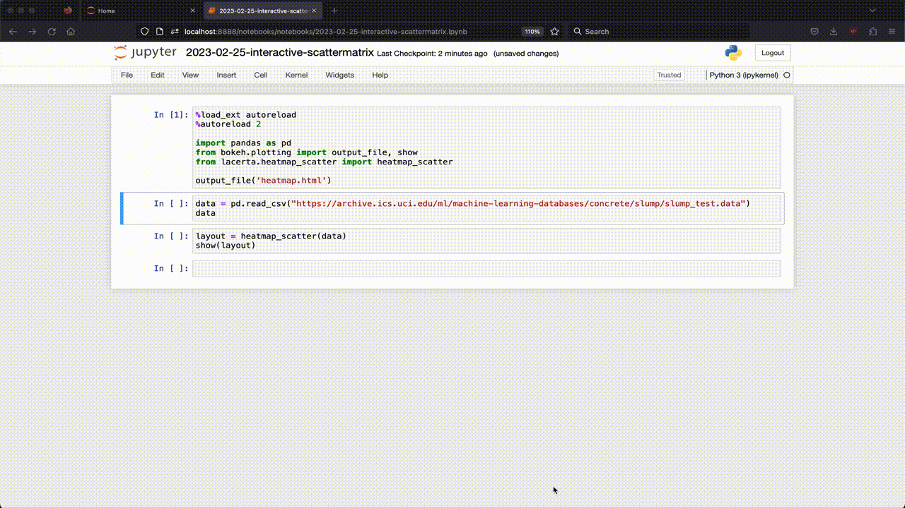

# lacerta
 Interactive data viz for science and engineering. Long-term goal is for `lacerta` to be for `bokeh` what `seaborn` is for `matplotlib` - strongly opinionated default settings, usability enhancements and auto-formatting that generate beautiful and interpretable viz in one function call.

 `pip install lacerta`

 ### Heatmap Scatter

Generate a correlation heatmap (defaults to Pearson coef.) from the numerical columns of a provided `DataFrame`, and reveal the underlying x/y scatter plot for each cell on click, complete with information-rich hover tools, scroll-zoom and pan.

See the provided [heatmap_scatter notebook](notebooks/2023-02-25-interactive-scattermatrix.ipynb) for an example.

